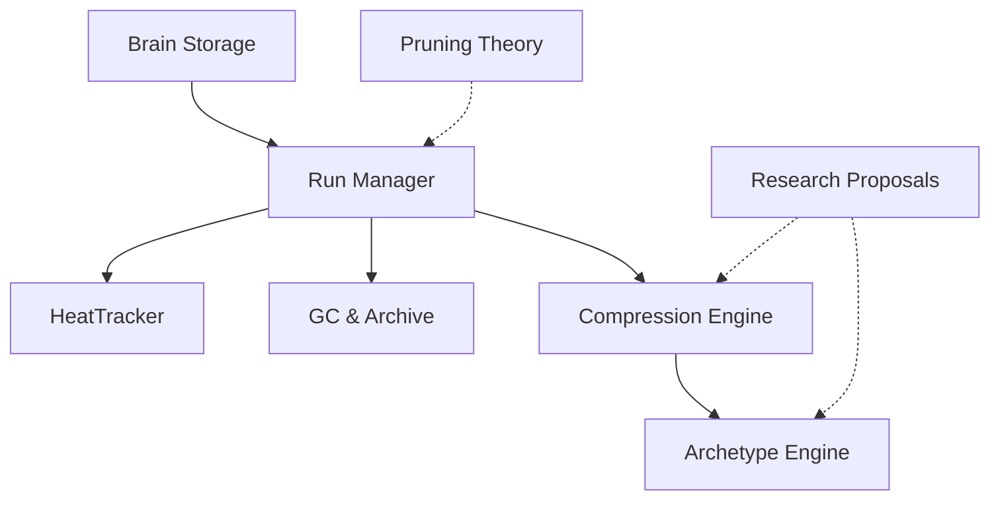

# Architecture at a Glance

## System Flowchart



## Data Flow at a Glance

```
╔═══════════════════════════════════════════════════════════════════════════════╗
║                         GRAPHIFY-BRAIN SYSTEM FLOW                          ║
╚═══════════════════════════════════════════════════════════════════════════════╝

  USER COMMANDS                         STORAGE LAYER                     PROCESSING
 ════════════════                     ════════════════                 ════════════════

  /memory save ──────▶ ┌─────────────────────────┐
                        │     Brain Storage       │
                        │  (ensureBrainDir,       │──▶ run-meta.json ──▶ HeatTracker
                        │   copyObsidianToVault)  │        │            records access
                        └─────────────────────────┘        │            temperatures
                                                           ▼
  /memory compress ──▶ ┌─────────────────────────┐   ┌──────────┐
                        │   Compression Engine    │   │  God     │
                        │  collapseToSupernodes   │──▶│  Nodes   │
                        │  generateSummaries      │   │  Ranked  │
                        └─────────────────────────┘   └──────────┘

  /memory archetypes ─▶ ┌─────────────────────────┐
                         │  Archetype Detection    │
                         │  MinHash → LSH → Match  │──▶ Cross-Project Patterns
                         └─────────────────────────┘

  /memory gc ─────────▶ ┌─────────────────────────┐
                         │     GC & Archive        │
                         │  30-Day Grace Period    │──▶ .archive/ directory
                         │  handleGc, handleKeep   │      (restorable)
                         └─────────────────────────┘

                         ┌─────────────────────────┐
                         │     Obsidian Vault      │
                         │  Wiki Sync, Vault Copy  │──▶ External .md viewer
                         └─────────────────────────┘
```

## How the System Fits Together

The graphify-brain memory system is a **layered architecture** built atop run-level storage. Each
run (a Pi session) generates a knowledge graph that is stored, indexed, temperature-tracked,
optionally compressed, and eventually archived. The layers stack like this:

### Layer 1: Storage — Run Management Engine (C5)

The **Run Management Engine** is the foundation. When you run `/memory save`, the system creates a
timestamped run directory under `memory/`. Functions like `runDirFor()`, `loadRunMeta()`, and
`writeRunMeta()` manage the lifecycle of every run. The engine also provides argument parsing
(`splitArgs`, `getFlagValue`) which acts as a central dispatch — nearly every other subsystem calls
through it.

### Layer 2: Temperature — HeatTracker Core (C6)

Every run is tracked with a **temperature** (hot, warm, cold). The `HeatTracker` class maintains
this as a file-backed state machine. Runs heat up when accessed (via `/memory load`) and cool down
over time through `decayTemperatures()`. This temperature feeds directly into the pruning system —
cold, unreferenced runs become candidates for removal.

### Layer 3: Pruning — Pruning Theory (C1)

Guided by the theoretical framework of the **5-Signal Score**, the pruning system evaluates each run
against five signals: staleness (35%), redundancy (25%), obsoletion (25%), low signal (15%), and
pinning as an override. The `computePruneScores()` function in the Run Manager applies this theory.
Pinned runs bypass pruning entirely.

### Layer 4: Compression — Fractal Compression Engine (C8)

When runs accumulate, `/memory compress` collapses the raw knowledge graph into **supernodes** —
one per community — producing a compressed graph with LLM-generated summaries. The engine builds on
research concepts from C7 (Fractal Memory, Graph Summarization, Coherence Scores).

### Layer 5: Archetypes — Archetype Detection Engine (C11)

Cross-project pattern detection uses **MinHash + LSH** to find structurally similar subgraphs
across runs. This enables the system to say "you've seen this pattern before in project X."
The pipeline: shingle text → MinHash signature → LSH band match → detect archetypes.

### Layer 6: GC & Archive — GC & Context Selectors (C9) + Archive System (C12)

The **garbage collector** (`handleGc`) moves expired runs to the `.archive/` directory with a
**30-day grace period**. During those 30 days, `/memory keep` can restore archived runs. After the
grace period, they are permanently deleted.

### Cross-Cutting: Obsidian Vault Integration (C4)

The monolith `graphify.ts` (84-degree god node) bridges all subsystems. It connects the code
communities (C5-C11) to the Obsidian vault, enabling wiki sync, vault copy, and external browsing
of memory artifacts through `.md` files.

### Cross-Cutting: Brain Storage Core (C0)

The test bundle (`graphify-test-bundle.js`) exercises nearly every function in the system — 39 test
targets under one file. It is self-contained, with no cross-community edges, serving as a
comprehensive regression suite rather than part of the production data flow.

## Core Concepts (God Nodes)

The most connected concepts form the backbone:

- **handleCompress()** (22 connections) — the #1 god node, orchestrates fractal compression
- **runDirFor()** (19 connections) — resolves run directory paths, used everywhere
- **slugify()** (17 connections) — normalizes project names into filesystem-safe slugs
- **loadRunMeta()** (14 connections) — loads run metadata, critical for load/zoom/compress
- **handleExpand()** (13 connections) — expands compressed supernodes back into full graphs
- **HeatTracker** (12 connections) — the temperature state machine class
- **recordRunAccess()** (12 connections) — bumps access timestamps across subsystems
- **handleGc()** (12 connections) — the garbage collection orchestrator
- **writeRunMeta()** (11 connections) — persists updated metadata after mutations
- **handleZoom()** (11 connections) — zooms into compressed communities for detail

## Community Map

| # | Community | Nodes | Character |
|---|-----------|-------|-----------|
| 0 | [[../02_TOP_COMMUNITIES/COMMUNITY_0|Brain Storage Core]] | 39 | code |
| 1 | [[../02_TOP_COMMUNITIES/COMMUNITY_1|Pruning Theory & Signals]] | 33 | concept |
| 2 | [[../02_TOP_COMMUNITIES/COMMUNITY_2|Wiki Documentation]] | 31 | concept |
| 3 | [[../02_TOP_COMMUNITIES/COMMUNITY_3|Graphify-Brain Architecture]] | 27 | concept |
| 4 | [[../02_TOP_COMMUNITIES/COMMUNITY_4|Obsidian Vault Integration]] | 23 | code |
| 5 | [[../02_TOP_COMMUNITIES/COMMUNITY_5|Run Management Engine]] | 21 | code |
| 6 | [[../02_TOP_COMMUNITIES/COMMUNITY_6|HeatTracker Core]] | 17 | code |
| 7 | [[../02_TOP_COMMUNITIES/COMMUNITY_7|Research Proposals]] | 12 | concept |
| 8 | [[../02_TOP_COMMUNITIES/COMMUNITY_8|Fractal Compression Engine]] | 10 | code |
| 9 | [[../02_TOP_COMMUNITIES/COMMUNITY_9|GC & Context Selectors]] | 9 | code |
| 10 | [[../02_TOP_COMMUNITIES/COMMUNITY_10|Core Command Handlers]] | 7 | code |
| 11 | [[../02_TOP_COMMUNITIES/COMMUNITY_11|Archetype Detection Engine]] | 7 | code |
| 12 | [[../02_TOP_COMMUNITIES/COMMUNITY_12|Archive System]] | 6 | concept |
| 13 | [[../02_TOP_COMMUNITIES/COMMUNITY_13|git-checkpoint Module (1 functions)]] | 1 | code |
| 14 | [[../02_TOP_COMMUNITIES/COMMUNITY_14|graphify-test-bundle Module (1 functions)]] | 1 | code |
| 15 | [[../02_TOP_COMMUNITIES/COMMUNITY_15|Domain: /memory stats Command]] | 1 | concept |
