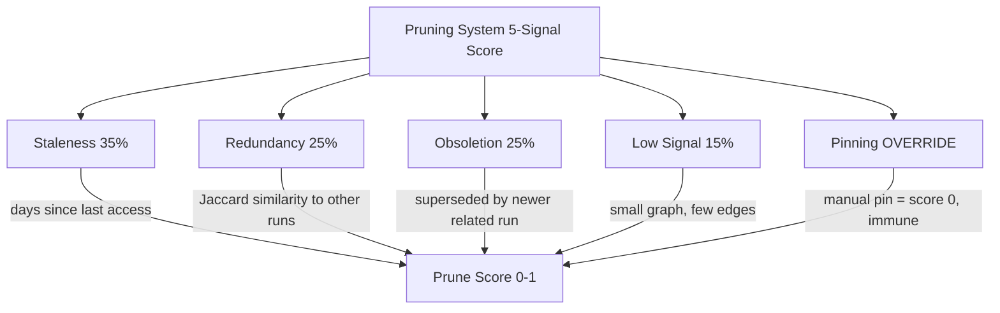

# Community 1: Pruning Theory & Signals

> **33 nodes** | **Cohesion: 0.08** (loosely connected — wide topic area) | **Character: concept**

## For Humans

### The Review Board

Picture a museum's acquisitions committee. They meet quarterly to decide which pieces stay on
display, which go to the archives, and which should be deaccessioned entirely. They have a
rubric: historical significance (35%), condition (25%), redundancy with other pieces (25%),
and visitor interest (15%). Some pieces are "pinned" — too important to ever remove, regardless
of the rubric.

The Pruning Theory & Signals community is that review board for your knowledge graph. It defines
**what makes a memory worth keeping** and **when it's time to let go**. This is the theoretical
foundation that the Run Management Engine's `computePruneScores()` and the GC's `handleGc()`
put into practice.

### The 5 Prune Signals



### Internal Architecture

```
┌─────────────────────────────────────────────────────────────────────────────┐
│                       PRUNING THEORY & SIGNALS                             │
│                                                                             │
│  ┌───────────────────────────────────────────────────────────────────────┐ │
│  │                   CORE PRUNING CONCEPTS                                │ │
│  │                                                                       │ │
│  │  Pruning System (5-Signal Score) ──▶ The decision framework           │ │
│  │       │                                                               │ │
│  │       ├──▶ Staleness (35%) ──▶ Days since last access                 │ │
│  │       ├──▶ Redundancy (25%) ──▶ Jaccard similarity to other runs      │ │
│  │       ├──▶ Obsoletion (25%) ──▶ Superseded by newer runs              │ │
│  │       ├──▶ Low Signal (15%) ──▶ Small/trivial run content             │ │
│  │       └──▶ Pinning Mechanism ──▶ Manual override (score = 0)          │ │
│  └───────────────────────────────────────────────────────────────────────┘ │
│                                                                             │
│  ┌───────────────────────────────────────────────────────────────────────┐ │
│  │                   THEORETICAL FOUNDATIONS                              │ │
│  │                                                                       │ │
│  │  Ebbinghaus Forgetting Curve ──▶ Memory decays exponentially          │ │
│  │  Cache Eviction (LRU/SIEVE) ──▶ Classic caching strategies            │ │
│  │  ARC Cache Algorithm ──▶ Adaptive replacement cache                   │ │
│  │  Centrality (Graph Theory) ──▶ Node importance in networks            │ │
│  │  Jaccard Similarity ──▶ Set overlap for redundancy detection          │ │
│  │  Subgraph Isomorphism (VF2) ──▶ Structural graph comparison           │ │
│  │  Weisfeiler-Lehman Color Refinement ──▶ Graph hashing for similarity  │ │
│  │  MinHash/LSH Semantic Deduplication ──▶ Probabilistic near-duplicates │ │
│  └───────────────────────────────────────────────────────────────────────┘ │
│                                                                             │
│  ┌───────────────────────────────────────────────────────────────────────┐ │
│  │                   TEMPERATURE SYSTEM                                   │ │
│  │                                                                       │ │
│  │  Temperature System (Hot/Warm/Cold) ──▶ 3-state access model           │ │
│  │  HeatTracker (Temperature System) ──▶ File-backed implementation       │ │
│  │  Cross-Project Archetypes ──▶ Patterns across projects                 │ │
│  └───────────────────────────────────────────────────────────────────────┘ │
│                                                                             │
│  ┌───────────────────────────────────────────────────────────────────────┐ │
│  │                   METADATA & STATE                                     │ │
│  │                                                                       │ │
│  │  brain-meta.json (Global State) ──▶ Cross-project brain state         │ │
│  │  run-meta.json (Run Metadata) ──▶ Per-run metadata                    │ │
│  │  meta.json (Project Metadata) ──▶ Per-project metadata                │ │
│  │  Run ID (ISO Timestamp) ──▶ Unique run identifier                     │ │
│  │  Project Slug (Normalized Name) ──▶ Filesystem-safe project name      │ │
│  └───────────────────────────────────────────────────────────────────────┘ │
│                                                                             │
│  ┌───────────────────────────────────────────────────────────────────────┐ │
│  │                   COMMANDS & ROADMAP                                   │ │
│  │                                                                       │ │
│  │  /memory prune Command ──▶ Trigger prune evaluation                   │ │
│  │  /memory pin Command ──▶ Protect a run from pruning                   │ │
│  │  /memory unpin Command ──▶ Remove pin protection                      │ │
│  │  6-Phase Roadmap ──▶ Development plan                                 │ │
│  │  Non-Negotiable Invariants ──▶ Design constraints                     │ │
│  │  8 Verification Gates ──▶ Quality checkpoints                         │ │
│  │  Backward Compatibility Guarantee ──▶ Migration safety                │ │
│  │  Implementation Handoff Document ──▶ Developer context                │ │
│  │  Phase 3A - Memory Safety & Archive Restore                           │ │
│  │  Phase 3A User Test Checklist (11 Tests)                              │ │
│  │  Verifier-Aware Memory Fields ──▶ Verification metadata               │ │
│  └───────────────────────────────────────────────────────────────────────┘ │
└─────────────────────────────────────────────────────────────────────────────┘
```

### What It Does and Why It Matters

Pruning is the **hardest problem in memory systems**. Keep everything and you drown in noise.
Delete too aggressively and you lose gold. The Pruning Theory community addresses this with:

**The 5-Signal Score:** A weighted rubric that evaluates each run on four dimensions, plus
a pin override:
- **Staleness (35%):** How long since this run was last accessed? Quantified by days since last
  `recordRunAccess()`. The Ebbinghaus Forgetting Curve inspires the intuition that memory value
  decays exponentially with disuse.
- **Redundancy (25%):** Is this run essentially a duplicate of another? Measured by Jaccard
  similarity of node label sets. Two runs about the same topic with identical graphs are candidates.
- **Obsoletion (25%):** Has a newer run superseded this one? If run-2026-05-15 covers the same
  project area as run-2026-05-01 but with more knowledge, the older run is obsolete.
- **Low Signal (15%):** Is this run trivial? If it has fewer than 5 nodes and 3 edges, it might
  represent a failed or abandoned session.
- **Pinning (override):** A pinned run has score 0 regardless of other signals. Manual `pin`
  / `unpin` commands give the user final say.

**Theoretical Frameworks**: The community connects pruning to well-known computer science concepts:
- **Ebbinghaus Forgetting Curve** (psychology) — memory value decays exponentially over time
- **Cache Eviction (LRU/SIEVE)** — operating system page replacement strategies
- **ARC Cache Algorithm** — adaptive caching that balances recency and frequency
- **Centrality** (graph theory) — node importance within networks
- **Subgraph Isomorphism (VF2)** and **Weisfeiler-Lehman** — structural graph comparison for
  deduplication beyond simple label matching

### Key Nodes

- **Pruning System (5-Signal Score)** (10 connections): The top node. Defines the entire pruning
  framework — signal weights, scoring algorithm, and integration points with GC.

- **run-meta.json (Run Metadata)** (9 connections): The per-run metadata format. Every run stores its prune score, temperature, compression state, access history, and pin status here.

- **6-Phase Roadmap** (6 connections): The development plan dividing the system into phases (Storage, Scoring, Temperature, Compression, Archetypes, Polish).

- **Non-Negotiable Invariants** (6 connections): Design constraints that must never be violated — backward compatibility, no data loss, archive-then-delete, pin immunity.

- **Pinning Mechanism** (5 connections): The manual override. Documents how pins are stored in run-meta.json and enforced at every prune/GC step.

### Bridge Analysis

Pruning Theory bridges to three other communities:

- **Graphify-Brain Architecture (C3)** — 5 edges. The architecture documents reference the
  pruning system, the 6-phase roadmap, and the invariants. The Run-Level Storage concept bridges
  to C1's roadmap.

- **Research Proposals (C7)** — 2 edges. The Tree Memory Proposal in C7 introduced the 5-signal
  score that C1 fully develops. The Unified Plan references C1's invariants.

- **Archive System (C12)** — 1 edge. The 30-Day Archive Grace Period is documented as a
  Non-Negotiable Invariant — it's impossible to discuss pruning without the safety net of archives.

### Cohesion Explained

At **0.08 cohesion**, this is the loosest large community. With 33 nodes sharing only 41 internal
edges, it spans a wide conceptual territory: pruning signals, temperature theory, metadata formats,
commands, roadmaps, invariants, and test checklists. These are all related to "pruning" in the
broadest sense, but they don't form a tight narrative.

The low cohesion is both expected and acceptable for a concept community. It's a reference library,
not a pipeline. The nodes that are genuinely connected (the 5 signals to the Pruning System, the
metadata to the commands that read it) have their edges, while documentation nodes like the test
checklist are loosely affiliated.

## For LLMs

### Data

- **ID:** 1
- **Label:** Pruning Theory & Signals
- **Size:** 33 nodes
- **Cohesion:** 0.08
- **Character:** concept
- **Primary files:** 01-tree-memory-proposal.md, 03-unified-plan.md, memory-system-improvement-handoff.md

### Top Nodes by Connectivity

- **Pruning System (5-Signal Score)** -- 10 connections [rationale]
- **run-meta.json (Run Metadata)** -- 9 connections [rationale]
- **6-Phase Roadmap** -- 6 connections [rationale]
- **Non-Negotiable Invariants** -- 6 connections [rationale]
- **Pinning Mechanism** -- 5 connections [rationale]
- **Ebbinghaus Forgetting Curve** -- 4 connections [rationale]
- **Cache Eviction (LRU/SIEVE)** -- 4 connections [rationale]
- **Staleness (Prune Signal, 35% weight)** -- 3 connections [rationale]
- **Redundancy (Prune Signal, 25% weight)** -- 3 connections [rationale]
- **Obsoletion (Prune Signal, 25% weight)** -- 3 connections [rationale]

### Cross-Community Connections

- **Graphify-Brain Architecture** (C3) -- 5 edge(s)
  - Pruning System -> graphify-brain Memory System (references)
  - 6-Phase Roadmap -> Run-Level Storage (implements)
  - Non-Negotiable Invariants -> Backward Compatibility Guarantee (constrains)
- **Research Proposals** (C7) -- 2 edge(s)
  - Pruning System -> Tree Memory Proposal (derives_from)
  - Non-Negotiable Invariants -> Unified Plan (constrains)
- **Archive System** (C12) -- 1 edge(s)
  - Non-Negotiable Invariants -> 30-Day Archive Grace Period (mandates)
