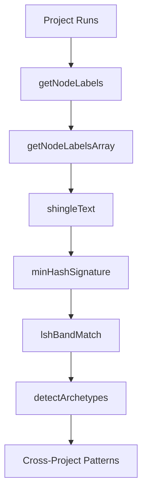

# Community 11: Archetype Detection Engine

> **7 nodes** | **Cohesion: 0.29** (moderately connected) | **Character: code**

## For Humans

### The Pattern Hunter

Imagine a detective who's seen thousands of crime scenes. They start noticing that certain
patterns repeat — a broken window here, a specific footprint there — even though the cases
are completely unrelated. The detective creates a catalog of these "archetypes" so future
investigators can recognize them instantly.

The Archetype Detection Engine does this for knowledge graphs. It scans runs across *different
projects* and detects structurally similar subgraphs. If your React app's component tree looks
like someone else's Vue app's component tree, the engine flags it: "You've seen this pattern
before."

This is the system's **cross-project memory** — it connects insights across project boundaries
using MinHash, Locality-Sensitive Hashing (LSH), and graph structure comparison.

### Internal Architecture

```
┌─────────────────────────────────────────────────────────────────────────────┐
│                       ARCHETYPE DETECTION ENGINE                            │
│                                                                             │
│  USER: /memory archetypes                                                   │
│       │                                                                     │
│       ▼                                                                     │
│  ┌───────────────────────────────────────────────────────────────────────┐ │
│  │  handleArchetypes()                                                    │ │
│  │     │                                                                  │ │
│  │     ▼                                                                  │ │
│  │  ┌──────────────────────────────────────────────────────────────────┐ │ │
│  │  │                     DETECTION PIPELINE                            │ │ │
│  │  │                                                                  │ │ │
│  │  │  Step 1: SHINGLING                                              │ │ │
│  │  │  getNodeLabels() ──▶ Collect node text from all runs             │ │ │
│  │  │  getNodeLabelsArray() ──▶ Normalize into arrays                  │ │ │
│  │  │  shingleText() ──▶ Break text into overlapping k-grams           │ │ │
│  │  │                        "Hello World" → ["Hel","ell","llo"...]    │ │ │
│  │  │                                                                  │ │ │
│  │  │  Step 2: MINHASH                                                │ │ │
│  │  │  minHashSignature() ──▶ Compress shingle set into fixed-size     │ │ │
│  │  │                          signature (128 hashes)                  │ │ │
│  │  │                                                                  │ │ │
│  │  │  Step 3: LSH BANDING                                            │ │ │
│  │  │  lshBandMatch() ──▶ Hash signature bands into buckets            │ │ │
│  │  │                      Bands that collide = candidate matches      │ │ │
│  │  │                                                                  │ │ │
│  │  │  Step 4: DETECTION                                               │ │ │
│  │  │  detectArchetypes() ──▶ Group candidates into archetype clusters │ │ │
│  │  │                          Report: "Pattern X found in 3 projects" │ │ │
│  │  └──────────────────────────────────────────────────────────────────┘ │ │
│  └───────────────────────────────────────────────────────────────────────┘ │
└─────────────────────────────────────────────────────────────────────────────┘
```

### What It Does and Why It Matters

Most memory systems are project-siloed: what you learn in project A stays in project A. The
Archetype Detection Engine breaks through silos by finding structural similarities:

- **Node label shingling**: Breaks text labels into overlapping character n-grams (k=3 by default). "runDirFor" becomes ["run", "unD", "nDi", "Dir", "irF", "rFo", "For"].

- **MinHash signature**: Creates a compact "fingerprint" of each graph using 128 hash functions. The Jaccard similarity between two signatures approximates the Jaccard similarity between the original shingle sets — without storing all the shingles.

- **LSH band matching**: Divides each signature into bands and hashes bands into buckets. If two signatures share a band hash, they're candidate matches. This reduces the comparison problem from O(n²) to O(n).

- **Archetype detection**: Clusters candidate matches into "archetypes" — recurring structural patterns labeled with the projects and runs they appear in.

### Key Nodes

- **detectArchetypes()** (5 connections): The main orchestrator. Takes candidate matches from LSH, clusters them into archetypes, and returns the structure. Called by `handleArchetypes()`.

- **getNodeLabels()** (3 connections): The text extractor. Walks every run's graph and collects node labels (file names, function signatures, concept labels) into a flat list for shingling.

- **getNodeLabelsArray()** (3 connections): The normalizer. Converts label lists into consistent arrays, handling edge cases like empty runs and unicode normalization.

- **minHashSignature()** (3 connections): The compressor. Generates the 128-hash MinHash signature from shingle sets. This is the core algorithm — everything downstream depends on signature quality.

- **handleArchetypes()** (3 connections): The command entry point. Parses arguments, loads runs for comparison, calls the detection pipeline, and formats output for the user.

- **shingleText()** (2 connections): The tokenizer. Produces k-grams from text. The choice of k (typically 3) trades off between granularity and noise resistance.

- **lshBandMatch()** (2 connections): The clustering engine. Groups signatures by band hashes and identifies which pairs have matching bands — meaning they're likely similar enough to warrant full comparison.

### Bridge Analysis

The Archetype Engine connects to only three other communities, reflecting its specialized role:

- **Obsidian Vault Integration (C4)** — 7 edges. All functions live in `graphify.ts`. The detection pipeline uses `detectCommunitiesTS()` from C4 under the hood.

- **Run Management Engine (C5)** — 1 edge. `handleArchetypes()` uses `resolveProjectRunFromArgs()` to determine which projects to compare.

- **GC & Context Selectors (C9)** — 1 edge. `handleArchetypes()` uses `hasFlag()` for argument parsing.

### Archetype Detection Pipeline



## For LLMs

### Data

- **ID:** 11
- **Label:** Archetype Detection Engine
- **Size:** 7 nodes
- **Cohesion:** 0.29
- **Character:** code
- **Primary file:** graphify.ts

### Top Nodes by Connectivity

- **detectArchetypes()** -- 5 connections [code]
- **getNodeLabels()** -- 3 connections [code]
- **getNodeLabelsArray()** -- 3 connections [code]
- **minHashSignature()** -- 3 connections [code]
- **handleArchetypes()** -- 3 connections [code]
- **shingleText()** -- 2 connections [code]
- **lshBandMatch()** -- 2 connections [code]

### Cross-Community Connections

- **Obsidian Vault Integration** (C4) -- 7 edge(s)
  - All functions contained in graphify.ts
- **Run Management Engine** (C5) -- 1 edge(s)
  - handleArchetypes() -> resolveProjectRunFromArgs()
- **GC & Context Selectors** (C9) -- 1 edge(s)
  - handleArchetypes() -> hasFlag()
