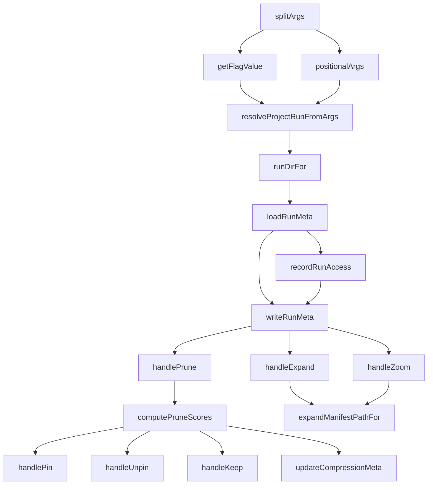

# Community 5: Run Management Engine

> **21 nodes** | **Cohesion: 0.30** (coherent and well-connected) | **Character: code**

## For Humans

### The Engine Room

Imagine the bridge of a ship. The captain issues commands, but it's the engine room — a tightly
coordinated crew of engineers, each with a specific station — that actually makes things happen.
That's the Run Management Engine. It doesn't decide *what* to remember; it runs the machinery
that makes remembering possible. When `/memory save` fires, when `/memory prune` evaluates runs,
when `/memory zoom` drills into a compressed graph — the Run Management Engine is turning the
cranks and spinning the gears.

This community is the **most coherent code community** in the system (0.30 cohesion), which
makes sense: every function participates in the lifecycle of a run. From resolving where a run
lives on disk (`runDirFor`) to scoring it for pruning (`computePruneScores`), to expanding it
from compressed form (`handleExpand`), these 21 functions form a tight pipeline.

### Internal Architecture

```
┌─────────────────────────────────────────────────────────────────────────────┐
│                        RUN MANAGEMENT ENGINE                                │
│                                                                             │
│  ┌─────────────────────┐    ┌─────────────────────┐    ┌────────────────┐  │
│  │   ARGUMENT PARSING  │    │   RUN LIFECYCLE     │    │   OPERATIONS   │  │
│  │                     │    │                     │    │                │  │
│  │  splitArgs()        │───▶│  runDirFor() ───────┼───▶│  handlePrune() │  │
│  │  getFlagValue()     │    │  loadRunMeta()      │    │  handlePin()   │  │
│  │  positionalArgs()   │    │  writeRunMeta()     │    │  handleUnpin() │  │
│  │                     │    │  recordRunAccess()  │    │  handleKeep()  │  │
│  └─────────────────────┘    │  findRunMetas()     │    │  handleExpand()│  │
│                              │  findRunMeta()      │    │  handleZoom()  │  │
│                              │  resolveProject-    │    │  handleFuse()  │  │
│                              │  RunFromArgs()      │    │                │  │
│                              └─────────────────────┘    └────────────────┘  │
│                                                                             │
│  ┌─────────────────────────────────────────────────────────────────────┐   │
│  │                         SCORING ENGINE                               │   │
│  │  computePruneScores() ──▶ pinMeta() ──▶ expandManifestPathFor()     │   │
│  │                              │                                       │   │
│  │  updateCompressionMeta() ◀───┘                                       │   │
│  └─────────────────────────────────────────────────────────────────────┘   │
└─────────────────────────────────────────────────────────────────────────────┘
```

### What It Does and Why It Matters

Every run in the graphify-brain has a lifecycle, and the Run Management Engine is responsible
for every stage of it:

- **Creation**: `runDirFor()` resolves where a run's data lives on disk (at `memory/<project>/<timestamp>/`). This single function has 19 connections because *every* subsystem needs to know where runs are stored.

- **Loading**: `loadRunMeta()` reads `run-meta.json` — the heartbeat record for each run. It's called by the load, zoom, expand, and compress subsystems.

- **Persistence**: `writeRunMeta()` saves updated metadata after access, scoring, or state transitions. `recordRunAccess()` bumps the access timestamp, feeding the HeatTracker.

- **Pruning**: `computePruneScores()` applies the 5-signal evaluation to every run, producing scores that determine which runs are candidates for garbage collection. `handlePrune()` orchestrates the full pruning pass, calling into compression and GC.

- **Pinning**: `pinMeta()`, `handlePin()`, and `handleUnpin()` allow users to protect valuable runs from pruning. Pin a run and it's immune to GC regardless of its score.

- **Compression Integration**: `handleExpand()` reverses compression by expanding a supernode back into its constituent nodes. `handleZoom()` zooms into a compressed community for detailed inspection. `handleFuse()` merges multiple runs' graphs. `updateCompressionMeta()` tracks compression state transitions on run metadata.

### Key Nodes

- **runDirFor()** (19 connections): The path resolver. Every subsystem that touches files uses this function to find run directories. It is the most-referenced utility in the codebase after `handleCompress()`.

- **loadRunMeta()** (14 connections): The metadata loader. Reads and parses `run-meta.json`, which contains everything the system knows about a run — timestamps, prune scores, compression state, pin status.

- **handleExpand()** (13 connections): The decompressor. When a user wants to see what's inside a compressed supernode, this function reconstructs the original nodes and edges from the compression manifest.

- **recordRunAccess()** (12 connections): The access tracker. Fires every time a run is loaded, zoomed, or expanded. Increments access count and updates timestamps — the raw material the HeatTracker uses for temperature calculation.

- **writeRunMeta()** (11 connections): The persistence layer. After any mutation to run state, this writes the updated `run-meta.json` back to disk.

- **handleZoom()** (11 connections): The inspector. Provides a detailed view into a specific community within a compressed graph without fully expanding it.

- **resolveProjectRunFromArgs()** (10 connections): The dispatcher. Parses command-line arguments to determine which project and run the user wants to operate on.

- **handleKeep()** (10 connections): The rescue hook. Restores a previously archived run from the `.archive/` directory back to active storage.

- **computePruneScores()** (10 connections): The evaluator. Calculates the 5-signal prune score for every run, producing the ranked list that the GC subsystem uses.

- **splitArgs()** (9 connections): The tokenizer. Parses raw command strings into structured arguments — the entry point for virtually every command handler.

### Bridge Analysis

The Run Management Engine is the **central hub** of the codebase. Its cross-community connections
read like a who's-who of every other operational subsystem:

- **Obsidian Vault Integration (C4)** — 23 edges. `graphify.ts` contains all these functions as methods. The vault integration layer is literally the file they live in. Every function in C5 is defined inside `graphify.ts`, which sits in C4.

- **Core Command Handlers (C10)** — 10 edges. Functions like `handleLoad()`, `handleLoadRun()`, and `handleStats()` in C10 call into `recordRunAccess()` and use `runDirFor()` from C5 to find and load runs.

- **GC & Context Selectors (C9)** — 10 edges. `handleGc()` in C9 depends on `computePruneScores()` from C5 to know which runs to clean up. `getProjectSlugsForCommand()` uses C5's argument parsing.

- **Fractal Compression Engine (C8)** — 10 edges. `handleCompress()` calls through `splitArgs()` and `getFlagValue()` for argument parsing, and `handleExpand()`/`handleZoom()` interact directly with compressed graph artifacts.

- **HeatTracker Core (C6)** — 8 edges. `recordRunAccess()` feeds the HeatTracker's `.recordAccess()`, and `writeRunMeta()` calls through to `handleSave()` when persisting temperature-bearing metadata.

- **Archetype Detection Engine (C11)** — 1 edge. `detectArchetypes()` uses run resolution to find graphs to compare across projects.

### Cohesion Explained

At **0.30 cohesion**, the Run Management Engine is the most coherent code community in the system.
This means its 21 functions have 62 internal edges out of a possible 210 — about 30% of all possible
connections are present. In practice, this reflects a **well-factored pipeline**: functions pass data
to each other in a clear sequence (parse args → resolve run → load meta → operate → write meta),
but not every function calls every other function. The pipeline structure means you can trace a
request from argument parsing to final output in a single community.

This is exactly the cohesion you want for a "manager" subsystem: focused enough to understand, broad
enough to orchestrate the rest of the system.

### Data Flow



## For LLMs

### Data

- **ID:** 5
- **Label:** Run Management Engine
- **Size:** 21 nodes
- **Cohesion:** 0.30
- **Character:** code
- **Primary file:** graphify.ts

### Top Nodes by Connectivity

- **runDirFor()** -- 19 connections [code]
- **loadRunMeta()** -- 14 connections [code]
- **handleExpand()** -- 13 connections [code]
- **recordRunAccess()** -- 12 connections [code]
- **writeRunMeta()** -- 11 connections [code]
- **handleZoom()** -- 11 connections [code]
- **resolveProjectRunFromArgs()** -- 10 connections [code]
- **handleKeep()** -- 10 connections [code]
- **computePruneScores()** -- 10 connections [code]
- **splitArgs()** -- 9 connections [code]

### Cross-Community Connections

- **Obsidian Vault Integration** (C4) -- 23 edge(s)
  - All C5 functions are contained within `graphify.ts` in C4
  - normalizeRunMeta() -> loadRunMeta(), handleKeep()
- **Core Command Handlers** (C10) -- 10 edge(s)
  - recordRunAccess() -> handleLoad(), handleLoadRun(), handleRuns()
  - runDirFor() -> handleLoadRun()
- **GC & Context Selectors** (C9) -- 10 edge(s)
  - splitArgs(), positionalArgs(), getFlagValue() -> handleGc()
  - computePruneScores() -> selectMemoryForContext()
- **Fractal Compression Engine** (C8) -- 10 edge(s)
  - splitArgs(), getFlagValue() -> handleCompress()
  - compressedGraphPathFor() -> handleZoom()
  - handleExpand() -> compressedGraphPathFor()
- **HeatTracker Core** (C6) -- 8 edge(s)
  - recordRunAccess() -> .recordAccess() in HeatTracker
  - writeRunMeta() -> handleSave()
- **Archetype Detection Engine** (C11) -- 1 edge(s)
  - resolveProjectRunFromArgs() -> handleArchetypes()
