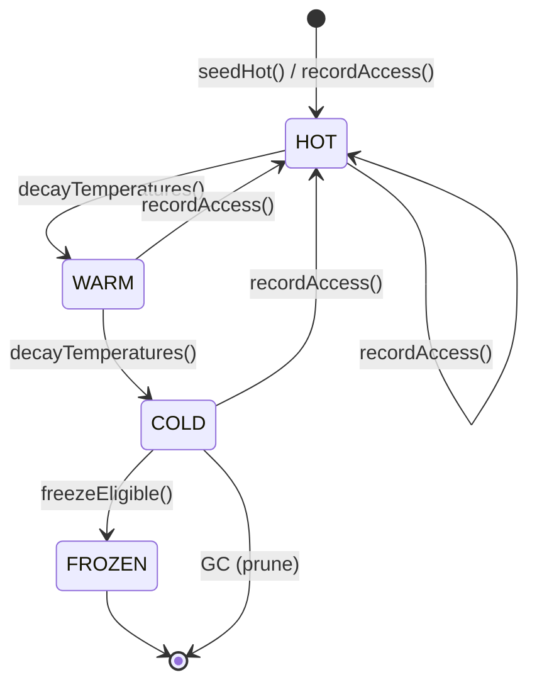

# Community 6: HeatTracker Core

> **17 nodes** | **Cohesion: 0.21** (moderately connected) | **Character: code**

## For Humans

### The Thermometer

Think of a refrigerator thermometer. It doesn't cool the food — it just watches the temperature
and tells you when things are getting too warm. The HeatTracker Core does the same for your saved
runs. Every run has a temperature: **hot** (recently accessed), **warm** (seen in the last few
days), or **cold** (untouched for a while). The `HeatTracker` class is a file-backed state machine
that tracks, decays, and reports these temperatures across every project you've saved.

It's deceptively simple — just three states and a handful of helper methods — but it powers the
pruning system's prioritization, the GC's candidate selection, and the compression engine's
eligibility checks.

### Internal Architecture

```
┌─────────────────────────────────────────────────────────────────────────────┐
│                           HEATTRACKER CORE                                  │
│                                                                             │
│  ┌─────────────────────────────────────────────────────────────────────┐   │
│  │                     HeatTracker Class (state machine)                │   │
│  │                                                                     │   │
│  │  .constructor() ──▶ .load() ──▶ .key() ──▶ .getOrMigrateEntry()    │   │
│  │       │                                     │                       │   │
│  │       │              ┌───────────────────────┘                       │   │
│  │       │              ▼                                               │   │
│  │       │    ┌─────────────────┐                                       │   │
│  │       └───▶│  .seedHot()     │──▶ Temperature: HOT                  │   │
│  │            │  .recordAccess()│──▶ Temperature: HOT → WARMS TO WARM  │   │
│  │            │  .decayTemp-    │──▶ Temperature: WARM → COLD          │   │
│  │            │  eratures()     │──▶ Temperature: COLD → GC-eligible   │   │
│  │            │  .getTemp-      │──▶ Returns: hot|warm|cold            │   │
│  │            │  erature()      │                                       │   │
│  │            │  .getEntry()    │──▶ Full entry with access count      │   │
│  │            │  .getStats()    │──▶ Aggregate temp distribution       │   │
│  │            │  .save()        │──▶ Persist to brain-meta.json        │   │
│  │            └─────────────────┘                                       │   │
│  └─────────────────────────────────────────────────────────────────────┘   │
│                                                                             │
│  ┌─────────────────────────────────────────────────────────────────────┐   │
│  │                     INFRASTRUCTURE HOOKS                             │   │
│  │                                                                     │   │
│  │  ensureBrainDir() ──▶ Creates memory/ if missing                    │   │
│  │  rebuildBrainIndex() ──▶ Rebuilds brain-meta.json from disk         │   │
│  │  handleSave() ──▶ Full save pipeline: meta + graph + vault          │   │
│  │  compressionTransition() ──▶ Updates temp on compression events     │   │
│  │  freezeEligible() ──▶ Checks if cold enough to freeze               │   │
│  └─────────────────────────────────────────────────────────────────────┘   │
└─────────────────────────────────────────────────────────────────────────────┘
```

### What It Does and Why It Matters

The HeatTracker is the **memory of how often you use your memory**. Without it, pruning would be
blind — the system wouldn't know which runs you care about and which you've forgotten. Here's how
it works:

1. **When you save**: `handleSave()` triggers `.seedHot()` — the new run starts at HOT temperature.
2. **When you load**: `handleLoad()` calls `recordRunAccess()` (in C5), which calls `.recordAccess()` — the run stays hot, and its access counter goes up.
3. **Over time**: `.decayTemperatures()` runs periodically. Each decay cycle moves temperatures one notch: HOT → WARM → COLD. The decay rate is configurable.
4. **At GC time**: The pruning system reads temperatures via `.getTemperature()`. Cold runs with low prune scores are top candidates for garbage collection.
5. **At compress time**: `freezeEligible()` checks whether a COLD run that's also compressed can be "frozen" — locked in compressed state with no further changes.

The beauty of the HeatTracker is that it's **completely decoupled from the access mechanism**.
Any subsystem that loads or views a run just calls `recordRunAccess()`. The HeatTracker doesn't
need to know *who* accessed the run or *why* — it just sees that someone was interested.

### Key Nodes

- **HeatTracker** (12 connections): The class itself. Contains all the temperature logic — the constructor, load/save persistence, key generation, and the full temperature lifecycle. The #6 god node overall.

- **.recordAccess()** (7 connections): The heartbeat. Called from `recordRunAccess()` in C5 whenever a run is loaded, zoomed, or expanded. Bumps access count and sets temperature to HOT.

- **.getTemperature()** (7 connections): The readout. Returns `hot`, `warm`, or `cold`. Called by the GC subsystem (`selectMemoryForContext`), compression engine (`handleCompress`), and prune scorer.

- **handleSave()** (7 connections): The save gate. Orchestrates the full save pipeline — ensures directories exist, writes run metadata, saves the graph, copies to Obsidian vault.

- **.getOrMigrateEntry()** (5 connections): The migration helper. When the HeatTracker schema changes, this function migrates old entries to the new format on read, ensuring backward compatibility.

- **ensureBrainDir()** (4 connections): The bootstrap. Guarantees that `memory/` exists on disk, creating it if needed. Called at the top of every command handler.

- **compressionTransition()** (4 connections): The compression hook. When a run transitions between compression states (RAW → COMPRESSED → FROZEN), this updates the HeatTracker entry to reflect the new state.

### Bridge Analysis

The HeatTracker sits at a key intersection in the data flow:

- **Obsidian Vault Integration (C4)** — 7 edges. `handleSave()` orchestrates the save pipeline that includes vault copying. The full `HeatTracker` class lives in `graphify.ts`.

- **Run Management Engine (C5)** — 8 edges. The heaviest bridge. `.recordAccess()` is called by `recordRunAccess()` in C5 on every load/zoom/expand. `handleSave()` is called by `writeRunMeta()` when persisting metadata.

- **Fractal Compression Engine (C8)** — 2 edges. `.getTemperature()` is called by `handleCompress()` to determine compression eligibility. `compressionTransition()` updates temperature state after compression completes.

- **GC & Context Selectors (C9)** — 1 edge. `selectMemoryForContext()` reads `.getTemperature()` to prioritize which runs to inject into the LLM context window.

- **Core Command Handlers (C10)** — 1 edge. `handleStats()` reads `.getStats()` to display temperature distribution in the stats command.

### Cohesion Explained

At **0.21 cohesion**, the HeatTracker Core is moderately connected. The internal edges (28) cluster
around the HeatTracker class itself — 13 of the 17 nodes are methods on the class or direct callers
of it. The remaining 4 nodes (`ensureBrainDir`, `rebuildBrainIndex`, `handleSave`, and the two
transition helpers) are slightly looser — they're infrastructure functions that "belong" here
because they work with brain-level state, but they don't call each other in a tight loop.

This is healthy. The class methods form a cohesive unit, and the infrastructure hooks wrap around
it like a thin shell. If the cohesion were much higher (0.40+), it might indicate unnecessary
tight coupling between the temperature system and the save pipeline. If it were much lower (0.10),
it might mean the infrastructure functions don't actually belong here.

### Temperature State Machine



## For LLMs

### Data

- **ID:** 6
- **Label:** HeatTracker Core
- **Size:** 17 nodes
- **Cohesion:** 0.21
- **Character:** code
- **Primary file:** graphify.ts

### Top Nodes by Connectivity

- **HeatTracker** -- 12 connections [code]
- **handleSave()** -- 7 connections [code]
- **.recordAccess()** -- 7 connections [code]
- **.getTemperature()** -- 7 connections [code]
- **.getOrMigrateEntry()** -- 5 connections [code]
- **ensureBrainDir()** -- 4 connections [code]
- **compressionTransition()** -- 4 connections [code]
- **.seedHot()** -- 4 connections [code]
- **.save()** -- 4 connections [code]
- **.key()** -- 4 connections [code]

### Cross-Community Connections

- **Obsidian Vault Integration** (C4) -- 7 edge(s)
  - All HeatTracker methods are contained in graphify.ts
  - handleSave() -> copyObsidianToVault(), ensureVault()
- **Run Management Engine** (C5) -- 8 edge(s)
  - .recordAccess() -> recordRunAccess(), handleExpand()
  - handleSave() -> writeRunMeta()
  - freezeEligible() -> handleKeep()
- **Fractal Compression Engine** (C8) -- 2 edge(s)
  - .getTemperature() -> handleCompress()
  - compressionTransition() -> handleCompress()
- **GC & Context Selectors** (C9) -- 1 edge(s)
  - .getTemperature() -> selectMemoryForContext()
- **Core Command Handlers** (C10) -- 1 edge(s)
  - .getStats() -> handleStats()
