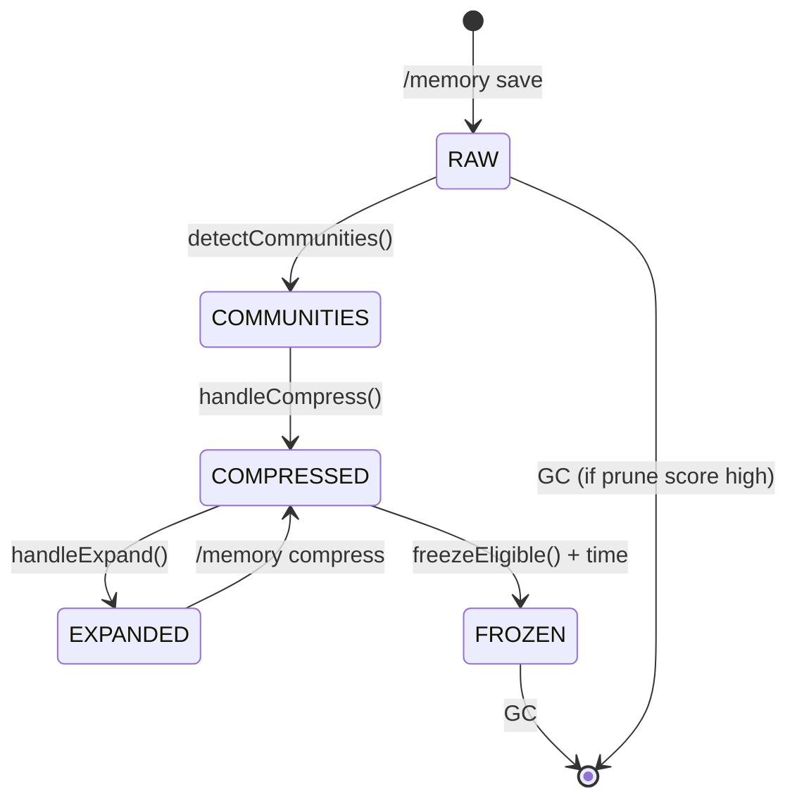

# Community 8: Fractal Compression Engine

> **10 nodes** | **Cohesion: 0.29** (moderately connected) | **Character: code**

## For Humans

### The Summarizer

Picture a librarian faced with 40,000 books. Nobody can browse all of them. So the librarian
groups books by topic, writes a one-paragraph summary for each shelf, and puts the summaries
on index cards. Now you can scan the cards, find the shelf you want, and pull the books.

That's exactly what the Fractal Compression Engine does for knowledge graphs. When you run
`/memory compress`, the engine groups the 245+ nodes into their communities, collapses each
community into a single "supernode" with an LLM-generated summary, and produces a compressed
graph that's a fraction of the original size. You can still zoom into any supernode to see
what's inside — the original data is preserved in a manifest file.

This community contains the **#1 god node in the entire codebase**: `handleCompress()` with
22 connections. It's the single most-referenced function because compression touches every
other subsystem — it must load run metadata, query temperatures, detect communities, generate
LLM summaries, write manifests, and update compression state.

### Internal Architecture

```
┌─────────────────────────────────────────────────────────────────────────────┐
│                      FRACTAL COMPRESSION ENGINE                             │
│                                                                             │
│  USER: /memory compress                                                     │
│       │                                                                     │
│       ▼                                                                     │
│  ┌─────────────────────────────────────────────────────────────────────┐   │
│  │                      handleCompress()  [22 edges, #1 God Node]      │   │
│  │                                                                     │   │
│  │  1. Load run metadata (via C5: loadRunMeta)                         │   │
│  │  2. Check temperature (via C6: getTemperature)                       │   │
│  │  3. Detect communities (via C4: detectCommunities)                   │   │
│  │  4. Calculate cohesion per community (cohesionScore)                 │   │
│  │  5. Collapse communities to supernodes (collapseToSupernodes)        │   │
│  │  6. Generate statistical summaries (statisticalSummary)              │   │
│  │  7. Generate LLM summaries (generateSummaries)                       │   │
│  │  8. Write compressed graph (compressedGraphPathFor)                  │   │
│  │  9. Write expand manifest (writeExpandManifestFile)                  │   │
│  └─────────────────────────────────────────────────────────────────────┘   │
│                                                                             │
│  ┌─────────────────────────────────────────────────────────────────────┐   │
│  │                        SUPPORT FUNCTIONS                             │   │
│  │                                                                     │   │
│  │  communitiesPathFor() ──▶ Resolves path to communities data file    │   │
│  │  compressedGraphPathFor() ──▶ Resolves path for compressed output   │   │
│  │  sha256File() ──▶ Content hash for dedup and integrity              │   │
│  │  cohesionScore() ──▶ Internal edge ratio per community              │   │
│  │  collapseToSupernodes() ──▶ Merges nodes within each community      │   │
│  │  statisticalSummary() ──▶ Node count, edge count, degree stats      │   │
│  │  generateSummaries() ──▶ LLM-powered paragraph per supernode        │   │
│  │  nodeIdsFromCommunity() ──▶ Extracts node IDs from community data   │   │
│  │  writeExpandManifestFile() ──▶ Saves expansion data for zoom/unpack │   │
│  └─────────────────────────────────────────────────────────────────────┘   │
└─────────────────────────────────────────────────────────────────────────────┘
```

### What It Does and Why It Matters

Knowledge graphs grow without bound. After 50 sessions, you might have 10,000+ nodes. Loading
the full graph into a context window becomes impossible. The Compression Engine solves this by
introducing **fractal compression** — the same technique at every scale:

1. **Detect communities** (via Louvain/Leiden in C4)
2. **Calculate cohesion** — how tight each community is internally
3. **Collapse to supernodes** — replace all nodes in a community with one representative node
4. **Generate summaries** — ask an LLM to describe what the community is about
5. **Save the manifest** — store the original nodes so `/memory expand` can reconstruct them

The result: a 245-node graph compresses to ~16 supernodes, each with a human-readable and
LLM-readable summary. You still preserve all the original data — it's lossless compression
because the manifest stores the full expansion recipe.

### Key Nodes

- **handleCompress()** (22 connections): The #1 god node. Orchestrates the entire compression pipeline from argument parsing to final output. Touches nearly every other community — it must load run data (C5), check temperatures (C6), detect communities (C4), generate summaries (C8 itself), and write output.

- **generateSummaries()** (5 connections): The LLM integration point. Takes a list of community supernodes and asks the LLM to write a descriptive summary for each. This is the "magic" that makes compressed graphs readable.

- **statisticalSummary()** (4 connections): Produces the numerical metadata that accompanies each supernode — how many nodes were collapsed, their degree distribution, file types involved.

- **compressedGraphPathFor()** (4 connections): Resolves where the compressed output file should be written. Called by `handleCompress()` and also by `handleZoom()` in C5 when loading compressed graphs.

- **collapseToSupernodes()** (4 connections): The structural transformation. Takes community assignments and replaces groups of nodes with single representative supernodes, preserving cross-community edges.

- **cohesionScore()** (4 connections): Calculates the internal edge density of a community — used to decide whether compression makes sense (poorly connected communities compress less usefully).

### Bridge Analysis

The Compression Engine is deeply connected across the codebase:

- **Obsidian Vault Integration (C4)** — 11 edges. All compression functions live in `graphify.ts`. `detectCommunities()` (in C4) is called directly by `handleCompress()` to find community boundaries before collapsing them.

- **Run Management Engine (C5)** — 10 edges. `handleCompress()` calls `splitArgs()`, `getFlagValue()`, `loadRunMeta()`, `writeRunMeta()`, and `handleExpand()` from C5. The compression pipeline is essentially orchestrated *through* the Run Manager.

- **Core Command Handlers (C10)** — 2 edges. `handleCompress()` imports `slugify()` for project name normalization in output paths.

- **HeatTracker Core (C6)** — 2 edges. `handleCompress()` reads `.getTemperature()` to determine whether a run is cold enough to be eligible for compression. `freezeEligible()` in C6 also calls back into compression state.

- **GC & Context Selectors (C9)** — 2 edges. `handleCompress()` uses `hasFlag()` for argument parsing.

### Compression State Machine



## For LLMs

### Data

- **ID:** 8
- **Label:** Fractal Compression Engine
- **Size:** 10 nodes
- **Cohesion:** 0.29
- **Character:** code
- **Primary file:** graphify.ts

### Top Nodes by Connectivity

- **handleCompress()** -- 22 connections [code]
- **generateSummaries()** -- 5 connections [code]
- **statisticalSummary()** -- 4 connections [code]
- **compressedGraphPathFor()** -- 4 connections [code]
- **collapseToSupernodes()** -- 4 connections [code]
- **cohesionScore()** -- 4 connections [code]
- **writeExpandManifestFile()** -- 3 connections [code]
- **communitiesPathFor()** -- 3 connections [code]
- **sha256File()** -- 2 connections [code]
- **nodeIdsFromCommunity()** -- 2 connections [code]

### Cross-Community Connections

- **Obsidian Vault Integration** (C4) -- 11 edge(s)
  - All C8 functions contained in graphify.ts
  - handleCompress() -> detectCommunities(), detectCommunitiesTS(), detectCommunitiesPython()
- **Run Management Engine** (C5) -- 10 edge(s)
  - handleCompress() -> splitArgs(), getFlagValue(), loadRunMeta(), writeRunMeta()
  - compressedGraphPathFor() -> handleZoom(), handleExpand()
- **Core Command Handlers** (C10) -- 2 edge(s)
  - handleCompress() -> slugify()
- **HeatTracker Core** (C6) -- 2 edge(s)
  - handleCompress() -> .getTemperature()
  - compressionTransition() -> handleCompress()
- **GC & Context Selectors** (C9) -- 2 edge(s)
  - handleCompress() -> hasFlag()
