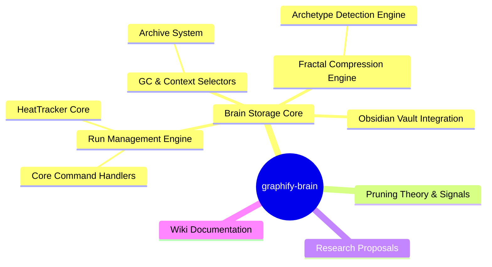

# Top Communities

> Top 16 communities by size, extracted from 245 nodes and 508 edges.

## Community Relationship Map

## Community Index

| # | Community | Nodes | Character | Cohesion | Key Concepts |
|---|-----------|-------|-----------|----------|-------------|
| 0 | [[COMMUNITY_0|Brain Storage Core]] | 39 | code | 0.10 | graphify-test-bundle.js, slugify(), computePruneScores(), ensureVault() |
| 1 | [[COMMUNITY_1|Pruning Theory & Signals]] | 33 | concept | 0.08 | Pruning System (5-Signal Score), run-meta.json (Run Metadata), Non-Negotiable Invariants, 6-Phase Roadmap |
| 2 | [[COMMUNITY_2|Wiki Documentation]] | 31 | concept | 0.10 | Community Narratives Index, Wiki Index, System Layers Index, Layer 3: Temperature (Wiki) |
| 3 | [[COMMUNITY_3|Graphify-Brain Architecture]] | 27 | concept | 0.11 | graphify-brain Memory System, /graphify Skill, Run-Level Storage (Phase 1), graphify-out/ Output Directory |
| 4 | [[COMMUNITY_4|Obsidian Vault Integration]] | 23 | code | 0.15 | graphify.ts, normalizeRunMeta(), ensureVault(), rebuildVaultIndex() |
| 5 | [[COMMUNITY_5|Run Management Engine]] | 21 | code | 0.30 | runDirFor(), loadRunMeta(), handleExpand(), recordRunAccess() |
| 6 | [[COMMUNITY_6|HeatTracker Core]] | 17 | code | 0.21 | HeatTracker, handleSave(), .recordAccess(), .getTemperature() |
| 7 | [[COMMUNITY_7|Research Proposals]] | 12 | concept | 0.20 | Fractal Memory Proposal, Fractal Compression, Unified Memory Management Plan, Tree Memory Proposal |
| 8 | [[COMMUNITY_8|Fractal Compression Engine]] | 10 | code | 0.29 | handleCompress(), generateSummaries(), statisticalSummary(), compressedGraphPathFor() |
| 9 | [[COMMUNITY_9|GC & Context Selectors]] | 9 | code | 0.22 | handleGc(), projectDirForSlug(), selectMemoryForContext(), getProjectSlugsForCommand() |
| 10 | [[COMMUNITY_10|Core Command Handlers]] | 7 | code | 0.29 | slugify(), handleStats(), handleLoadRun(), handleLoad() |
| 11 | [[COMMUNITY_11|Archetype Detection Engine]] | 7 | code | 0.29 | detectArchetypes(), minHashSignature(), handleArchetypes(), getNodeLabelsArray() |
| 12 | [[COMMUNITY_12|Archive System]] | 6 | concept | 0.33 | Garbage Collection (Archive/Restore), .archive/ Directory (Grace Period), 30-Day Archive Grace Period, /memory gc Command |
| 13 | [[COMMUNITY_13|git-checkpoint Module (1 functions)]] | 1 | code | 0.00 | git-checkpoint.ts Extension |
| 14 | [[COMMUNITY_14|graphify-test-bundle Module (1 functions)]] | 1 | code | 0.00 | graphify-test-bundle.js |
| 15 | [[COMMUNITY_15|Domain: /memory stats Command]] | 1 | concept | 0.00 | /memory stats Command |

## Understanding Community Cohesion

Cohesion measures how tightly a community's nodes are interconnected — how many internal edges
exist relative to the theoretical maximum. Think of it as a measure of "focus":

| Cohesion Range | Label | What It Means | Example |
|----------------|-------|---------------|---------|
| **0.00 – 0.15** | Loose | Nodes are only tangentially related. May be a broad topic area or a collection of loosely affiliated parts. Could indicate that the community should be split. | C0 (Brain Storage Core, 0.10) — 39 test functions that exercise many parts of the system but don't form a tight subsystem of their own. |
| **0.15 – 0.30** | Moderate | Nodes share a clear purpose but have some internal divisions. A healthy balance for medium-sized communities with a clear domain. | C6 (HeatTracker Core, 0.21) — the HeatTracker class and its callers form a cohesive temperature layer, but the save/rebuild functions pull in adjacent concerns. |
| **0.30 – 0.50** | Coherent | Nodes are tightly focused on a single responsibility. Functions call each other frequently, forming a clear pipeline. | C5 (Run Management Engine, 0.30) — every function participates in the run lifecycle: resolve, load, score, prune, expand, zoom, fuse. |
| **0.50+** | Tight | Very rarely achieved. Would indicate an unusually focused group with near-complete internal connectivity. | None in this codebase. C12 (Archive System, 0.33) is the closest — 6 nodes all about the archive grace period workflow. |

### What High Cohesion Means for You

Communities with high cohesion (like C5 at 0.30 and C12 at 0.33) represent **well-factored
subsystems**. When you need to change how runs are managed, you know exactly where to look — the
Run Management Engine. When you need to adjust garbage collection policy, the Archive System is
self-contained.

### What Low Cohesion Means for You

Low cohesion communities (like C0 at 0.10 and C1 at 0.08) are **topic clusters** rather than
subsystems. They group related ideas or test targets but don't represent a single mechanism you
can change in isolation. C0 (the test bundle) is an extreme case — it's a test suite that
exercises many different functions but has no internal data flow of its own.

### The Sweet Spot

The code communities (C5-C12) cluster in the 0.20-0.33 range — moderately tight, with clear
responsibilities. The concept communities (C1, C2, C3, C7) are looser (0.08-0.20), which is
expected: design documents and architectural concepts naturally spread across broader territory.
