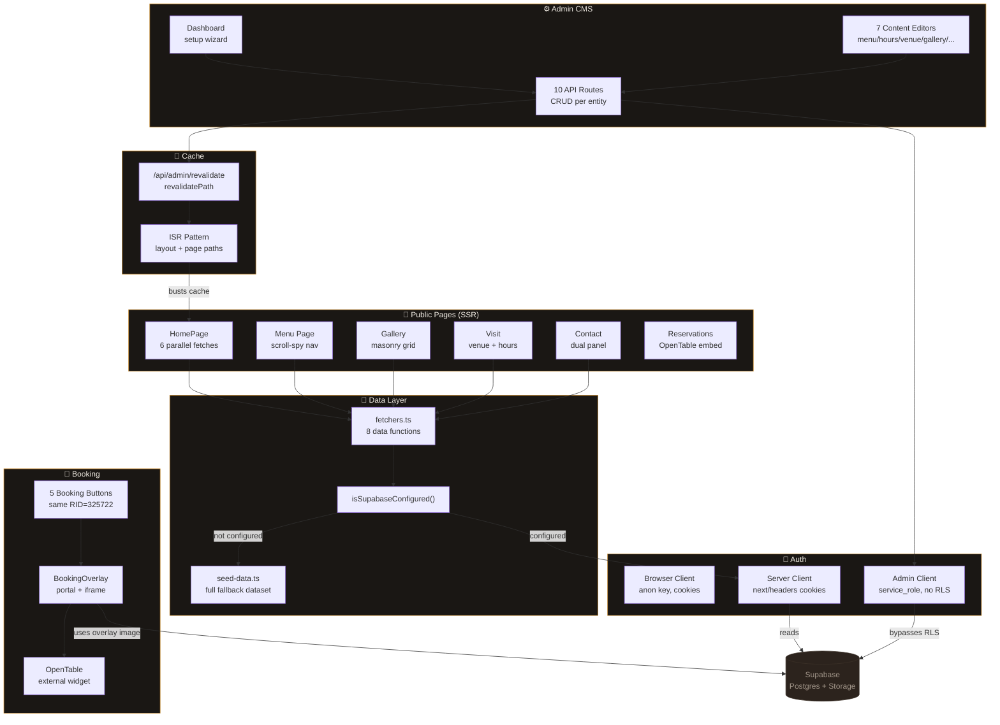

# Architecture at a Glance

## The Big Picture

Ramen Don is a **CMS-driven Next.js restaurant website** backed by Supabase. Think of it as a three-layer cake:

1. **Public Layer** — Server-rendered pages that fetch data from Supabase (or fall back to hardcoded seed data)
2. **Admin Layer** — Client-side React dashboard that CRUDs restaurant content via API routes
3. **Booking Layer** — OpenTable widget integration through a portal-based overlay with sandbox protection

Every admin change triggers **ISR revalidation** so public pages refresh instantly.

## System Architecture



## Data Flow: From CMS Edit to Live Site

```
┌──────────────────┐     ┌──────────────────┐     ┌──────────────────┐
│  Admin saves      │────▶│  PATCH /api/admin │────▶│  Supabase         │
│  (page.tsx)       │     │  /venue (route.ts)│     │  venue_details    │
└──────────────────┘     └────────┬─────────┘     └──────────────────┘
                                  │
                                  ▼
                         ┌──────────────────┐
                         │  POST /api/admin  │
                         │  /revalidate      │
                         └────────┬─────────┘
                                  │
                    ┌─────────────┼─────────────┐
                    ▼             ▼             ▼
            ┌──────────┐  ┌──────────┐  ┌──────────┐
            │ revalidate│  │ revalidate│  │ revalidate│
            │ Path("/", │  │ Path("/", │  │ Path("/  │
            │ "layout") │  │ "page")  │  │ visit",  │
            │           │  │           │  │ "page")  │
            └──────────┘  └──────────┘  └──────────┘
                    │             │             │
                    └─────────────┼─────────────┘
                                  ▼
                         ┌──────────────────┐
                         │  Next visitor sees │
                         │  fresh content     │
                         └──────────────────┘
```

## Core Abstractions

### The Three-Tier Supabase Client Pattern

```
┌─────────────────────────────────────────────────────────────────┐
│                    Supabase Client Architecture                   │
├─────────────────┬─────────────────┬─────────────────────────────┤
│  Browser Client  │  Server Client   │  Admin Client               │
│  (supabase.ts)   │  (supabase-      │  (supabase-admin.ts)        │
│                  │   server.ts)     │                             │
├─────────────────┼─────────────────┼─────────────────────────────┤
│  Key: anon       │  Key: anon       │  Key: service_role           │
│  Auth: cookies   │  Auth: cookies   │  Auth: none (bypasses RLS)  │
│  Used by:        │  Used by:        │  Used by:                   │
│  • Login page    │  • fetchers.ts   │  • All API routes            │
│  • AuthWatcher   │  • Public pages  │  • Setup wizard              │
│  • AdminNav      │                  │                             │
│  • signOut()     │                  │                             │
├─────────────────┼─────────────────┼─────────────────────────────┤
│  NOT cached at   │  Fresh per       │  Throws if env vars          │
│  module level    │  request         │  are missing                 │
│  (avoids stale   │  (reads current  │                             │
│   refresh token) │   cookies)       │                             │
└─────────────────┴─────────────────┴─────────────────────────────┘
```

### The Seed Data Fallback Chain

```
                    Request comes in
                          │
                          ▼
                ┌─────────────────────┐
                │ isSupabaseConfigured │
                │       ()?           │
                └─────────┬───────────┘
                     ┌────┴────┐
                     │ NO      │ YES
                     ▼         ▼
              ┌──────────┐  ┌──────────────┐
              │ Return    │  │ Try Supabase  │
              │ seed data │  │ query         │
              └──────────┘  └──────┬───────┘
                              ┌────┴────┐
                              │Success  │Error
                              ▼         ▼
                         ┌────────┐  ┌──────────┐
                         │ Return │  │ Return    │
                         │ live   │  │ seed data │
                         │ data   │  │ (fallback)│
                         └────────┘  └──────────┘
```

Every data path has a fallback. The site **works without Supabase** — it just shows static seed content. If Supabase is configured but temporarily down, errors are caught and seed data is served. This is resilience by design.

## Community Map

| # | Community | Nodes | Role |
|---|-----------|-------|------|
| 0 | [[../02_TOP_COMMUNITIES/COMMUNITY_0|Data Fetching & Supabase Integration]] | 19 | The bridge between pages and data |
| 1 | [[../02_TOP_COMMUNITIES/COMMUNITY_1|Public Page Composition]] | 18 | How public pages are assembled |
| 2 | [[../02_TOP_COMMUNITIES/COMMUNITY_2|Admin API Route Handlers]] | 16 | REST endpoints for CMS operations |
| 3 | [[../02_TOP_COMMUNITIES/COMMUNITY_3|Admin CMS Panel & ISR]] | 15 | The admin dashboard and cache invalidation |
| 4 | [[../02_TOP_COMMUNITIES/COMMUNITY_4|Booking Overlay & Navigation]] | 15 | OpenTable widget integration |
| 5 | [[../02_TOP_COMMUNITIES/COMMUNITY_5|Admin Image Management]] | 12 | Gallery upload and hero image selection |
| 8 | [[../02_TOP_COMMUNITIES/COMMUNITY_8|Auth & Supabase Client Architecture]] | 9 | Authentication layer and client types |
| 10 | [[../02_TOP_COMMUNITIES/COMMUNITY_10|API Fallback Pattern]] | 7 | Resilience through seed data |
| 11 | [[../02_TOP_COMMUNITIES/COMMUNITY_11|Menu Scroll Navigation]] | 6 | Scroll-spy and smooth nav |
| 18 | [[../02_TOP_COMMUNITIES/COMMUNITY_18|OpenTable External Integration]] | 3 | Restaurant ID and external booking |

## Key Design Decisions

1. **Seed data fallback everywhere** — the site is functional with zero configuration
2. **Service role key for admin API** — bypasses RLS so admin operations are unrestricted
3. **No module-level browser client cache** — prevents stale refresh token bugs after middleware rotation
4. **Portal-based booking overlay** — keeps OpenTable iframe isolated in a React portal with sandbox attributes
5. **Layout-level revalidation** — busts the root layout cache so Header/Footer refresh their overlay image
