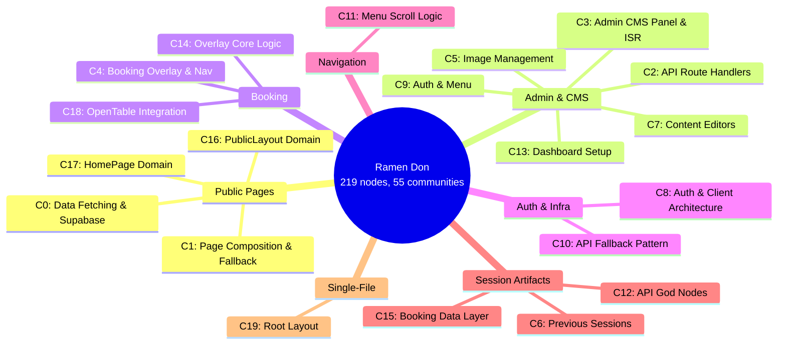
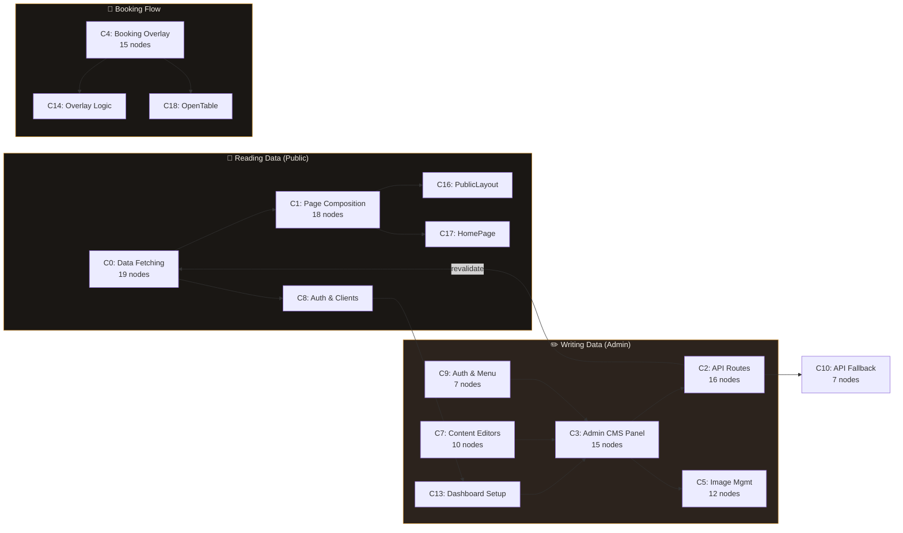

# Top Communities

> 20 communities from the Ramen Don knowledge graph. Each page has a "For Humans" narrative and a "For LLMs" data section.

## Community Mindmap

## Community Flow: How Data Moves Through the System

## Community Listing

| # | Community | Nodes | Character | Cohesion | Key Concepts |
|---|-----------|-------|-----------|----------|-------------|
| 0 | [[COMMUNITY_0|Data Fetching & Supabase Integration]] | 19 | code | 0.23 | isSupabaseConfigured(), createSupabaseServerClient(), fetchers.ts, 8 get* functions |
| 1 | [[COMMUNITY_1|Public Page Composition & Fallback Architecture]] | 18 | code | 0.14 | Homepage Composer, Server Component Pattern, Seed Data, Dark Theme |
| 2 | [[COMMUNITY_2|Admin API Route Handlers]] | 16 | code | 0.27 | GET(), PATCH(), POST(), DELETE(), createSupabaseAdminClient() |
| 3 | [[COMMUNITY_3|Admin CMS Panel & ISR]] | 15 | code | 0.21 | ISR Revalidation, 7 admin CRUD pages, Button component, CMS Pattern |
| 4 | [[COMMUNITY_4|Booking Overlay & Navigation UI]] | 15 | code | 0.18 | BookingOverlay, 5 booking buttons, OpenTable RID, Portal Pattern |
| 5 | [[COMMUNITY_5|Admin Image Management]] | 12 | code | 0.30 | revalidate(), gallery CRUD, hero toggle, upload |
| 6 | [[COMMUNITY_6|Previous Session Artifacts]] | 12 | concept | 0.24 | Graphify memory system, /raw workflow, Obsidian vault |
| 7 | [[COMMUNITY_7|Admin Content Editors]] | 10 | code | 0.00 | Homepage editor, Hours editor, Venue editor, handleSave() |
| 8 | [[COMMUNITY_8|Auth & Supabase Client Architecture]] | 9 | code | 0.28 | Three-tier clients, AdminAuthWatcher, Login, AdminNav |
| 9 | [[COMMUNITY_9|Admin Auth & Menu Management]] | 7 | code | 0.00 | MenuAdminPage, handleSubmit(), createSupabaseBrowserClient() |
| 10 | [[COMMUNITY_10|API Fallback Pattern]] | 7 | code | 0.29 | Seed fallback in every route, 6 API route implementations |
| 11 | [[COMMUNITY_11|Menu Scroll Navigation Logic]] | 6 | code | 0.60 | MenuNav, scrollTo(), updateActive(), getScrollOffset() |
| 12 | [[COMMUNITY_12|API Route God Nodes (Session)]] | 4 | concept | 0.50 | GET/PATCH/POST god node documentation |
| 13 | [[COMMUNITY_13|Admin Dashboard Setup Wizard]] | 3 | code | 0.00 | page.tsx, runSetup(), checkConfiguration() |
| 14 | [[COMMUNITY_14|BookingOverlay Core Logic]] | 3 | code | 0.00 | BookingOverlay.tsx, onKey(), handleNavigate() |
| 15 | [[COMMUNITY_15|Admin Booking Data Layer (Session)]] | 3 | concept | 0.67 | isSupabaseConfigured, createSupabaseServerClient |
| 16 | [[COMMUNITY_16|PublicLayout Domain]] | 3 | concept | 0.00 | PublicLayout(), getVenueDetails(), getBookingOverlayImage() |
| 17 | [[COMMUNITY_17|HomePage Domain]] | 3 | concept | 0.00 | HomePage(), getHomepageSections(), getOpeningHours() |
| 18 | [[COMMUNITY_18|OpenTable External Integration]] | 3 | mixed | 0.67 | RID 325722, Reservations Page, OpenTableWidget |
| 19 | [[COMMUNITY_19|Root Layout]] | 2 | code | 0.00 | layout.tsx, RootLayout() |

---

**Cohesion guide:** 0.00-0.15 loose / 0.15-0.30 moderate / 0.30-0.50 coherent / 0.50+ tight
