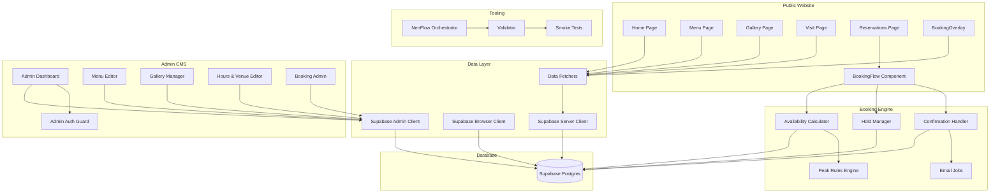

# Architecture at a Glance

## For Humans

Think of the ramen-don codebase as a **full-service restaurant**:

- **The Dining Room** (Public Website) — what customers see: the hero banner, menu, gallery, and the booking desk where they reserve a table.
- **The Kitchen** (Data & API Layer) — where orders are prepared: fetching data from the database, calculating table availability, and recording bookings.
- **The Manager's Office** (Admin CMS) — where staff control the menu, upload photos, set hours, and configure booking rules.
- **The Health Inspector** (NenFlow & Testing) — an independent system that validates the whole operation, runs smoke tests, and makes sure nothing breaks when the menu changes.

These four zones talk to each other through well-defined doors and windows — the **god nodes** below are the busiest pass-throughs.

### System Architecture

## Core Concepts (God Nodes)

The most connected concepts form the backbone:

- **bookingDbConfigured()** (23 connections) — The booking system's on/off switch. Every booking API route asks this function "are we using real Supabase or dev fallback?" before proceeding.
- **createSupabaseAdminClient()** (20 connections) — The master key. Creates a Supabase client with service-role privileges, used by every admin route that writes to the database.
- **requireAdminUser()** (20 connections) — The bouncer at the admin door. Every admin API route calls this first to verify the request comes from an authenticated admin.
- **calculateAvailability()** (12 connections) — The brain of the booking engine. Takes party size, date, opening hours, existing bookings, holds, peak rules, and blocked periods — returns exactly what tables are free.
- **isSupabaseConfigured()** (11 connections) — The pre-flight check. Every data fetcher asks this before querying Supabase; if unconfigured, it falls back to seed data.
- **getAvailabilityData()** (11 connections) — The booking system's one-stop data shop. Gathers resources, rules, bookings, holds, blocked periods, and opening hours into a single AvailabilityData object.
- **main()** (10 connections) — The NenFlow validator's entry point. Parses artifacts, checks context saturation, and routes validation to the right role validator.
- **GET()** (10 connections) — The most common API verb in admin routes. Powers all read operations across menu, gallery, hours, venue, bookings, and bowl management.
- **createSupabaseServerClient()** (10 connections) — The public-facing database connection. Used by data fetchers that run server-side for public page rendering.
- **revalidate()** (9 connections) — The cache-buster. Called after every admin CMS save to tell Next.js ISR to regenerate the affected public pages.

## Community Map

| # | Community | Nodes | Character |
|---|-----------|-------|-----------|
| 0 | [[../02_TOP_COMMUNITIES/COMMUNITY_0|Herox Module (42 functions)]] | 42 | code |
| 1 | [[../02_TOP_COMMUNITIES/COMMUNITY_1|route Module (36 functions)]] | 36 | code |
| 2 | [[../02_TOP_COMMUNITIES/COMMUNITY_2|server-data Module (31 functions)]] | 31 | code |
| 3 | [[../02_TOP_COMMUNITIES/COMMUNITY_3|pagex Module (22 functions)]] | 22 | code |
| 4 | [[../02_TOP_COMMUNITIES/COMMUNITY_4|fetchers Module (19 functions)]] | 19 | code |
| 5 | [[../02_TOP_COMMUNITIES/COMMUNITY_5|time Module (18 functions)]] | 18 | code |
| 6 | [[../02_TOP_COMMUNITIES/COMMUNITY_6|validator Module (12 functions)]] | 12 | code |
| 7 | [[../02_TOP_COMMUNITIES/COMMUNITY_7|pagex Module (12 functions)]] | 12 | code |
| 8 | [[../02_TOP_COMMUNITIES/COMMUNITY_8|Domain: Session: Building the Graphify Mem...]] | 12 | concept |
| 9 | [[../02_TOP_COMMUNITIES/COMMUNITY_9|pagex Module (10 functions)]] | 10 | code |
| 10 | [[../02_TOP_COMMUNITIES/COMMUNITY_10|smoke_test Module (8 functions)]] | 8 | code |
| 11 | [[../02_TOP_COMMUNITIES/COMMUNITY_11|pagex Module (7 functions)]] | 7 | code |
| 12 | [[../02_TOP_COMMUNITIES/COMMUNITY_12|MenuNavx Module (6 functions)]] | 6 | code |
| 13 | [[../02_TOP_COMMUNITIES/COMMUNITY_13|pagex Module (5 functions)]] | 5 | code |
| 14 | [[../02_TOP_COMMUNITIES/COMMUNITY_14|BookingFlowx Module (5 functions)]] | 5 | code |
| 15 | [[../02_TOP_COMMUNITIES/COMMUNITY_15|nav_guard_test.mjs Module (4 functions)]] | 4 | code |
| 16 | [[../02_TOP_COMMUNITIES/COMMUNITY_16|nav_guard_test_v2.mjs Module (4 functions)]] | 4 | code |
| 17 | [[../02_TOP_COMMUNITIES/COMMUNITY_17|nav_guard_test_v3.mjs Module (4 functions)]] | 4 | code |
| 18 | [[../02_TOP_COMMUNITIES/COMMUNITY_18|nav_guard_test_v4.mjs Module (4 functions)]] | 4 | code |
| 19 | [[../02_TOP_COMMUNITIES/COMMUNITY_19|email-jobs Module (4 functions)]] | 4 | code |