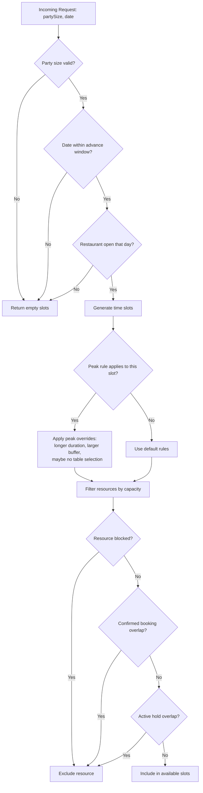

# Community 5: time Module (18 functions)

> **18 nodes** | **Cohesion: 0.24** (moderately connected) | **Character: code**

## For Humans

### Analogy: The Seating Computer

This community is like **the computerized seating system** that tells the host exactly which tables are free at what times. It knows the restaurant's hours, the table layout, the booking rules, the peak-time constraints, and the turnover buffers.

`calculateAvailability()` is the main query: "2 guests, Friday May 22nd — what's available?" It returns a list of time slots, each with a list of compatible tables, accounting for party size, peak rules, existing bookings, active holds, and blocked periods.

### Architecture

```
┌─────────────────────────────────────────────────────────────┐
│                  BOOKING AVAILABILITY ENGINE                  │
├─────────────────────────────────────────────────────────────┤
│                                                              │
│  ┌──────────────────────────────────────────────────┐       │
│  │         calculateAvailability()                   │       │
│  │           (The Brain — 12 edges)                  │       │
│  │                                                   │       │
│  │   Input: { partySize, date, resourcePreference } │       │
│  │   Output: AvailabilitySlot[] with resources       │       │
│  └──────────────────────┬───────────────────────────┘       │
│                         │                                    │
│     ┌───────────────────┼───────────────────┐                │
│     │                   │                   │                │
│  ┌──▼──────────┐  ┌─────▼──────┐  ┌────────▼────────┐      │
│  │ Time Engine │  │Peak Rules  │  │ Resource Filter │      │
│  │             │  │ Engine     │  │                  │      │
│  │┌──────────┐│  │┌──────────┐│  │┌───────────────┐│      │
│  ││addMinutes││  ││peakRule  ││  ││resourceFits() ││      │
│  ││makeSlots ││  ││For()     ││  ││(capacity min/ ││      │
│  ││dayOfWeek ││  ││(5 edges) ││  ││ max check)    ││      │
│  ││Utc()     ││  │└──────────┘│  │└───────────────┘│      │
│  ││overlaps()││  │┌──────────┐│  │┌───────────────┐│      │
│  ││minutes   ││  ││applyPeak ││  ││isResourceFree ││      │
│  ││FromTime()││  ││Rule()    ││  ││() checks:     ││      │
│  │└──────────┘│  ││(duration,││  ││• blocks       ││      │
│  └────────────┘  ││ buffer,  ││  ││• bookings     ││      │
│                  ││ table    ││  ││• active holds ││      │
│                  ││ override)││  │└───────────────┘│      │
│                  │└──────────┘│  └─────────────────┘      │
│                  └────────────┘                             │
│                                                              │
│  ┌──────────────────────────────────────────────────┐       │
│  │  Opening Hours Gate                               │       │
│  │  ┌──────────────────────────────────────────┐    │       │
│  │  │ Restaurant closed on that day? → 0 slots │    │       │
│  │  │ Party size out of range? → 0 slots       │    │       │
│  │  │ Date beyond advance window? → 0 slots    │    │       │
│  │  │ Peak rule blocks party size? → skip slot │    │       │
│  │  └──────────────────────────────────────────┘    │       │
│  └──────────────────────────────────────────────────┘       │
└─────────────────────────────────────────────────────────────┘

┌─────────────────────────────────────────────────────────────┐
│               PEAK-TIME RULES ENGINE                          │
├─────────────────────────────────────────────────────────────┤
│                                                              │
│  ┌──────────────────────────────────────────────────┐       │
│  │  peakRuleFor(date, time, data)                    │       │
│  │  Matches the current slot against configured      │       │
│  │  peak rules (e.g., Friday 5PM-10:30PM)           │       │
│  └──────────────────────┬───────────────────────────┘       │
│                         │                                    │
│                  ┌──────▼──────┐                             │
│                  │ applyPeak   │                             │
│                  │ Rule()      │                             │
│                  │             │                             │
│                  │ Overrides:  │                             │
│                  │ • duration  │                             │
│                  │   (90→105)  │                             │
│                  │ • buffer    │                             │
│                  │   (15→20)   │                             │
│                  │ • table     │                             │
│                  │   selection │                             │
│                  │   allowed?  │                             │
│                  └─────────────┘                             │
└─────────────────────────────────────────────────────────────┘
```

### Data Flow (Mermaid)



### What It Does

This is the **Booking Availability Engine** (18 nodes, cohesion 0.24). It transforms raw data (tables, rules, bookings, holds) into customer-facing availability slots. This is the most algorithmic community — pure computation, no UI.

**Key nodes:**
- **calculateAvailability()** (12 edges) — The god node of the booking engine. Called by the availability API route. Returns `AvailabilitySlot[]`.
- **addMinutes()** (6 edges) — Date arithmetic used throughout slot generation.
- **peakRuleFor()** (5 edges) — Matches a time slot against configured peak rules.
- **makeSlots()** (5 edges) — Generates discrete time slots between open and close.
- **dayOfWeekUtc()** (4 edges) — Day-of-week calculation for opening hours matching.
- **overlaps()** — Range overlap check used by `isResourceFree()`.

### Bridges to Other Communities

- **To Community 2** (server-data): 6 edges — `route.ts` and `POST()` handlers import from `availability.ts`, `parseHoldPayload()`, and `BookingPersistenceError`.
- **To Community 1** (API routes): 3 edges — `route.ts` imports `bookingDbConfigured()`.

### Why Cohesion is Moderate (0.24)

Higher cohesion than most because these functions form a clear pipeline: time utilities feed into slot generation, which feeds into peak rules, which feeds into resource filtering. They call each other in a logical chain.

## For LLMs

### Data

- **ID:** 5
- **Label:** time Module (18 functions)
- **Size:** 18 nodes
- **Cohesion:** 0.24
- **Character:** code
- **Primary file:** time.ts

### Top Nodes by Connectivity

- **calculateAvailability()** -- 12 connections [code]
- **availability.ts** -- 11 connections [code]
- **time.ts** -- 8 connections [code]
- **route.ts** -- 7 connections [code]
- **POST()** -- 7 connections [code]
- **addMinutes()** -- 6 connections [code]
- **peakRuleFor()** -- 5 connections [code]
- **makeSlots()** -- 5 connections [code]
- **rules.ts** -- 4 connections [code]
- **dayOfWeekUtc()** -- 4 connections [code]

### Cross-Community Connections
- **server-data Module (31 functions)** (C2) -- 6 edge(s)
  - route.ts -> parseHoldPayload() (imports)
  - route.ts -> BookingPersistenceError (imports)
- **route Module (36 functions)** (C1) -- 3 edge(s)
  - route.ts -> bookingDbConfigured() (imports)
  - POST() -> bookingDbConfigured() (calls)
