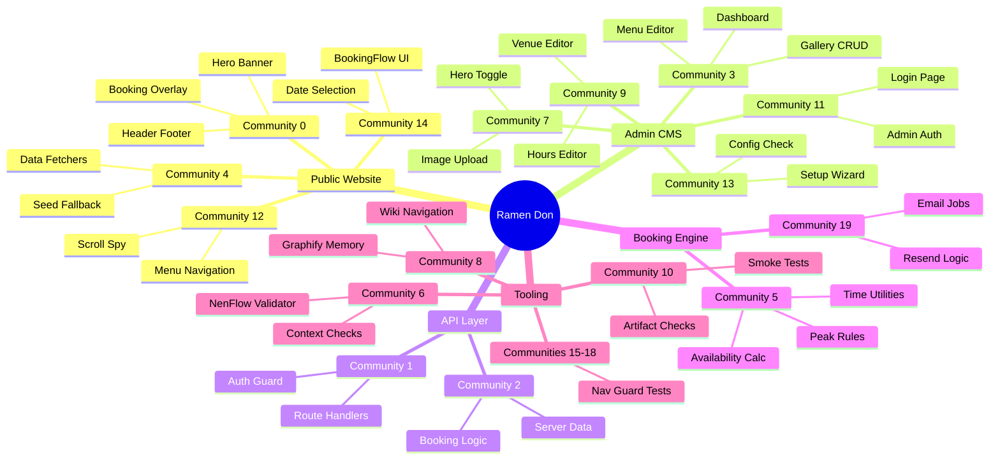

# Top Communities

## For Humans

### System Narrative

Ramen Don started as a **CMS-driven restaurant website** — a Next.js app where staff could edit the menu, upload photos, and set opening hours through an admin panel, and the public site would rebuild with fresh content.

Then a **native booking system** was added. Instead of relying on an external OpenTable widget, the site now calculates real-time table availability, creates time-limited holds, confirms bookings, and generates email confirmation jobs — all backed by Supabase Postgres with exclusion constraints that prevent double-booking.

Running alongside the app is a **NenFlow v3 orchestration system** — a validator, smoke tests, context-policy checks, and a graphify memory system that maps how everything connects.

The 20 communities below show these three layers — public website, admin CMS, and tooling — plus the booking engine that bridges them.

### Community Relationship Map

## Community Index

> Top 20 communities by size.

| # | Community | Nodes | Character | Cohesion | Key Concepts |
|---|-----------|-------|-----------|----------|-------------|
| 0 | [[COMMUNITY_0|Herox Module (42 functions)]] | 42 | code | 0.07 | Supabase Three-Tier Client ..., Homepage Multi-Section Comp..., HeroBookingButton (Overlay ..., BookingOverlay (createPorta... |
| 1 | [[COMMUNITY_1|route Module (36 functions)]] | 36 | code | 0.14 | bookingDbConfigured(), requireAdminUser(), createSupabaseAdminClient(), GET() |
| 2 | [[COMMUNITY_2|server-data Module (31 functions)]] | 31 | code | 0.12 | getAvailabilityData(), lookupConfirmedBooking(), server-data.ts, route.ts |
| 3 | [[COMMUNITY_3|pagex Module (22 functions)]] | 22 | code | 0.13 | ISR On-Demand Revalidation ..., Seed Data Fallback in Every..., Button (Polymorphic: Link o..., Admin Signature Bowls (CRUD... |
| 4 | [[COMMUNITY_4|fetchers Module (19 functions)]] | 19 | code | 0.23 | isSupabaseConfigured(), createSupabaseServerClient(), fetchers.ts, HomePage() |
| 5 | [[COMMUNITY_5|time Module (18 functions)]] | 18 | code | 0.24 | calculateAvailability(), availability.ts, time.ts, route.ts |
| 6 | [[COMMUNITY_6|validator Module (12 functions)]] | 12 | code | 0.36 | validator.js, main(), checkContextSaturation(), validateVerifier() |
| 7 | [[COMMUNITY_7|pagex Module (12 functions)]] | 12 | code | 0.30 | revalidate(), page.tsx, page.tsx, page.tsx |
| 8 | [[COMMUNITY_8|Domain: Session: Building the Graphify Mem...]] | 12 | concept | 0.24 | graph.json (Compiled Knowle..., Session: Building the Graph..., Graphify Pipeline (56-file ..., Three-Layer Memory Stack (S... |
| 9 | [[COMMUNITY_9|pagex Module (10 functions)]] | 10 | code | 0.00 | page.tsx, page.tsx, page.tsx, handleSave() |
| 10 | [[COMMUNITY_10|smoke_test Module (8 functions)]] | 8 | code | 0.43 | smoke_test.js, testRun(), readFm(), pass() |
| 11 | [[COMMUNITY_11|pagex Module (7 functions)]] | 7 | code | 0.00 | page.tsx, handleSubmit(), createSupabaseBrowserClient(), supabase.ts |
| 12 | [[COMMUNITY_12|MenuNavx Module (6 functions)]] | 6 | code | 0.60 | MenuNav.tsx, updateActive(), scrollTo(), getScrollOffset() |
| 13 | [[COMMUNITY_13|pagex Module (5 functions)]] | 5 | code | 0.00 | page.tsx, runSetup(), runSetup(), checkConfiguration() |
| 14 | [[COMMUNITY_14|BookingFlowx Module (5 functions)]] | 5 | code | 0.00 | BookingFlow.tsx, todayPlus(), findAvailability(), createHold() |
| 15 | [[COMMUNITY_15|nav_guard_test.mjs Module (4 functions)]] | 4 | code | 0.00 | nav_guard_test.mjs, STEP(), PASS(), FAIL() |
| 16 | [[COMMUNITY_16|nav_guard_test_v2.mjs Module (4 functions)]] | 4 | code | 0.00 | nav_guard_test_v2.mjs, STEP(), PASS(), FAIL() |
| 17 | [[COMMUNITY_17|nav_guard_test_v3.mjs Module (4 functions)]] | 4 | code | 0.00 | nav_guard_test_v3.mjs, STEP(), PASS(), FAIL() |
| 18 | [[COMMUNITY_18|nav_guard_test_v4.mjs Module (4 functions)]] | 4 | code | 0.00 | nav_guard_test_v4.mjs, STEP(), PASS(), FAIL() |
| 19 | [[COMMUNITY_19|email-jobs Module (4 functions)]] | 4 | code | 0.00 | markResendPending(), email-jobs.ts, createPendingEmailJob(), booking-email-jobs.test.ts |

---

**Cohesion guide:** 0.0-0.15 loose / 0.15-0.30 moderate / 0.30-0.50 coherent / 0.50+ tight