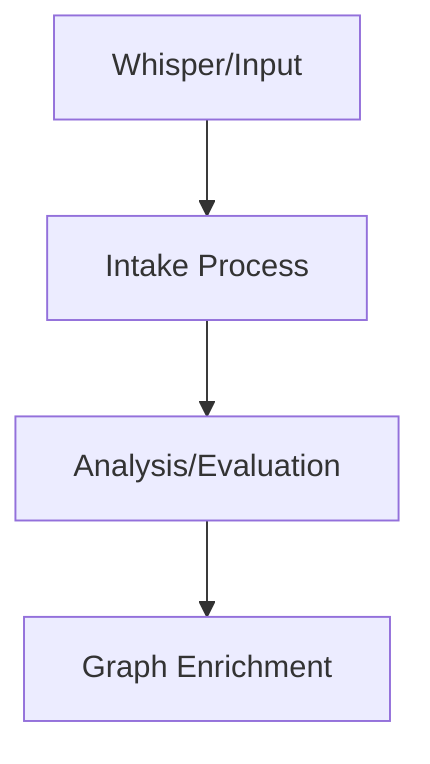

# Architecture at a Glance

## Architecture at a Glance

## Core Concepts (God Nodes)
...

The most connected concepts form the backbone:

- **Whisper** (1 connections)
- **Intake** (1 connections)
- **Analysis** (1 connections)
- ****Date**:** (1 connections)
- **2026-05-11** (1 connections)

## Community Map

| # | Community | Nodes | Character |
|---|-----------|-------|-----------|
| 0 | [[../02_TOP_COMMUNITIES/COMMUNITY_0|Intake Process]] | 6 | concept |